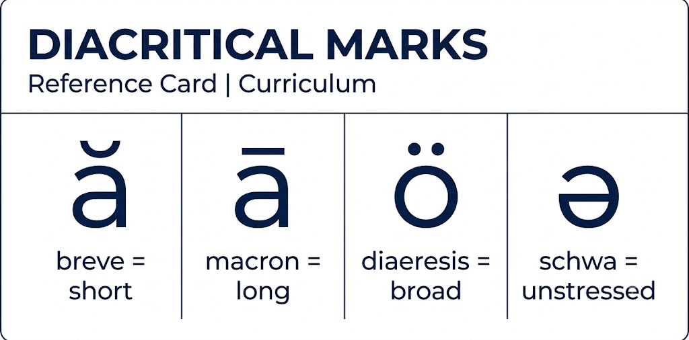

# Teach Your Child to Read: An OpenPhonograms Curriculum

## Adapted from the Methodology of Denise Eide

> This is an *adaptation* of the methodology described in Denise Eide's
> *Uncovering the Logic of English* (2012). Eide is the original
> methodology author; this curriculum is a re-presentation of her
> phonograms, rules, and lesson structure for a printable, open-source
> release. See [`LICENSE`](./LICENSE) and [`NOTICE`](./NOTICE) for
> licensing and full attribution.

---

## Table of Contents

1. [Introduction: Why This Works](#introduction)
2. [Core Principles](#core-principles)
3. [The 106 Tools: Overview](#the-106-tools)
4. [Scope & Sequence: Stage-by-Stage](#scope--sequence)
5. [Daily Lesson Structure](#daily-lesson-structure)
6. [Teaching Methodology: Spelling Analysis](#spelling-analysis)
7. [Complete Phonogram List](#complete-phonogram-list)
8. [Complete Spelling Rules](#complete-spelling-rules)
9. [Materials & Resources](#materials)
10. [Stage 1: Phonemic Awareness & First Phonograms (Pre-K / Age 4-5)](#stage-1)
11. [Stage 2: CVC Words & Short Vowels (Kindergarten / Age 5-6)](#stage-2)
12. [Stage 3: Multi-Letter Phonograms & Silent E (Grade 1 / Age 6-7)](#stage-3)
13. [Stage 4: Advanced Phonograms & Syllables (Grade 2 / Age 7-8)](#stage-4)
14. [Stage 5: Morphology & Fluency (Grade 3+ / Age 8+)](#stage-5)
15. [High-Frequency Words the Logic of English Way](#high-frequency-words)
16. [Troubleshooting & FAQ](#troubleshooting)
17. [Assessment & Pacing](#assessment)

---

## Introduction

### The Problem

Most English speakers believe English spelling is chaotic — full of exceptions that must be memorized. This is false. **98% of English words** follow predictable patterns when you know:

- **75 basic phonograms** (the written representations of sounds)
- **31 spelling rules** (the rules governing how phonograms interact)
- **44 phonemes** (the speech sounds of English)

Together, these **106 tools** unlock the code of written English.

### The Promise

A child who masters these tools will:
- Decode unfamiliar words independently instead of guessing
- Spell accurately by applying rules, not rote memory
- Read with confidence because the system makes sense
- Transfer these skills to any English word they encounter

### Who This Curriculum Is For

- Parents teaching children at home (ages 4+)
- Tutors working one-on-one
- Classroom teachers seeking a structured literacy supplement
- Older struggling readers who need the system explained clearly

### How to Use This Document

This curriculum is organized into **five stages** spanning pre-K through approximately grade 3. Each stage builds on the prior one. Start at the stage that matches your child's current ability — use the placement guidance at each stage.

**Key rule:** Never skip the phonemic awareness activities, even if your child already knows some letters. Every strong reader starts with strong sound discrimination.

---

## Core Principles

### 1. Speech-to-Print (Not Print-to-Speech)

Traditional phonics teaches: "This letter says /a/."  
Logic of English teaches: "The sound /ă/ is written with the phonogram **a**."

Why this matters: Children already know spoken words. We build from the known (speech sounds) to the unknown (written symbols). This is the single most important shift in this curriculum.

### 2. Explicit & Systematic

Every rule is taught directly. Nothing is left for the child to "pick up." Phonograms and rules are introduced in a logical order where each new concept builds on previous ones.

### 3. Multi-Sensory

Every lesson engages:
- **Hearing** (say the word, segment the sounds)
- **Speaking** (repeat the word, say the sounds)
- **Writing** (write the phonograms and words)
- **Seeing** (read back what was written)

### 4. No Sight Words (As Traditionally Defined)

Words like *the*, *of*, *was* — traditionally memorized as wholes — are taught through their phonograms and rules. The child learns *why* each is spelled that way. The term "high-frequency word" replaces "sight word" — they are words worth learning early because they appear often, not because they must be memorized blindly.

### 5. Spelling Drives Reading

Spelling Analysis — saying a word, segmenting it into sounds, writing the phonograms, and analyzing the rules — is the core instructional routine. Research shows that **improving spelling brings immediate gains in reading fluency** (Ouellette et al., 2017).

### 6. Morphology Supports Phonology

English preserves spelling to preserve meaning. The A in *vacate* → *evacuate* → *vacation* changes sound but keeps its spelling so the relationship between the words remains visible. Teach children to see these connections.

---

## The 106 Tools

| Category | Count | Description |
|----------|-------|-------------|
| Single-letter phonograms | 26 | a-z, each making 1-6 sounds |
| Multi-letter phonograms | 49 | sh, th, igh, ough, etc. |
| **Total Basic Phonograms** | **75** | The written building blocks |
| Spelling Rules | 31 | The rules governing phonogram use |
| Speech Sounds (Phonemes) | 44 | The spoken sounds of English |
| **Total Tools** | **106** | Explains 98% of English words |

---

## Scope & Sequence

### Overview Map

| Stage | Age | Focus |
|-------|-----|-------|
| 1 | Pre-K (4-5) | Phonemic awareness + first 26 single-letter phonograms |
| 2 | K (5-6) | CVC words, short vowels, first multi-letter phonograms, first spelling rules, consonant blends |
| 3 | Gr 1 (6-7) | Silent Final E (all 9 reasons), vowel teams, more multi-letter phonograms, syllable division |
| 4 | Gr 2 (7-8) | Advanced phonograms (ough, augh, etc.), schwa, suffixing rules, morphology introduction |
| 5 | Gr 3+ (8+) | Latin roots, advanced morphology, vocabulary building, fluency focus |

### What the Child Will Be Able to Do

| After Stage | Reading | Writing |
|-------------|---------|---------|
| Stage 1 | Know all a-z phonograms and their sounds | Write lowercase a-z from dictation |
| Stage 2 | Decode CVC, CCVC, CVCC; read phrases | Spell short-vowel words; write sentences |
| Stage 3 | Read all common phonograms; early decodable books | Spell with silent E, vowel teams, rules |
| Stage 4 | Read multi-syllable words; early chapter books | Spell with suffixing rules |
| Stage 5 | Read fluently at grade level | Spell accurately; understand word structure |

---

## Daily Lesson Structure

Every lesson follows this 20-40 minute pattern:

### 1. Phonogram Review (3-5 min)
- Flash through previously taught phonogram cards
- Child says ALL sounds for each phonogram, in order of frequency
- Teacher tracks which phonograms need more practice

### 2. New Phonogram Introduction (3-5 min)
- Introduce ONE new phonogram (or one new spelling rule)
- Show the card, say the sounds, child repeats
- Child writes the phonogram while saying its sounds
- Discuss: multi-letter name, any related spelling rule

### 3. Phonemic Awareness Drill (3-5 min)
- Blending: "I'll say sounds, you say the word: /k/ /ă/ /t/ → cat"
- Segmenting: "Say 'cat'. What sounds do you hear? /k/ /ă/ /t/"
- Sound manipulation: "Say 'cat'. Change /k/ to /b/. What word?" → bat

### 4. Spelling Analysis (10-15 min)
- 3-5 words per lesson, using the Spelling Analysis routine (see below)
- Words chosen to practice the new phonogram/rule PLUS review previous ones
- Child writes each word, analyzes phonograms and rules

### 5. Reading Practice (5-10 min)
- Read words on a whiteboard or word list using the day's focus
- Read decodable phrases or sentences
- Once reading connected text: read from decodable books

### 6. Optional: Handwriting Practice (5 min)
- Practice letter formation for newly taught phonograms
- Copy a sentence from the lesson

---

## Teaching Methodology: Spelling Analysis

This is the heart of every lesson. Follow these steps for each word:

### For One-Syllable Words

| Step | Teacher Does | Student Does |
|------|-------------|-------------|
| **1. Hear & Say** | Say the word. Use in a sentence. | Repeat the word. |
| **2. Segment** | "What sounds do you hear in ___?" | Segment word into individual sounds while teacher holds up fingers (1 finger = 1-letter phonogram, 2 fingers = 2-letter phonogram, etc.) |
| **3. Write** | Watch as child writes. | Write the word, sounding it out while writing each phonogram. |
| **4. Analyze** | "What phonograms did you use? What rules apply? Let's underline multi-letter phonograms." | Identify phonograms. Circle markings for rules (e.g., underline silent E and draw arrow back to vowel). |
| **5. Read** | "Read the word sound by sound, then blend." | Read each phonogram sound, then blend into the word. |

### For Multi-Syllable Words: Add "Say-to-Spell"

When a word contains schwa (the lazy /ŭ/ or /ĭ/ sound in unstressed syllables), use **say-to-spell**. This is NOT optional — schwa appears in the majority of multi-syllable English words, and without say-to-spell, the child cannot hear the spelling information.

1. Say the word normally: "about" → /ə-bout/
2. Say-to-spell (pause between syllables, stress every vowel): "ā-bout"
3. The child segments the say-to-spell version
4. This preserves the spelling information that normal pronunciation hides

**Example:**  
- Word: *little*  
- Normal: /lĭt-əl/  
- Say-to-spell: /lĭt-tlē/ (pause between syllables, articulate double T, stress the E)  
- Now the child hears why there are two T's and an E at the end

**When to introduce:** Stage 2, as soon as the first multi-syllable word appears in spelling analysis. The word `lit·tle` arrives with Rule 12.4 (every syllable needs a vowel). That's the moment to introduce say-to-spell.

---

## Complete Phonogram List

### Single-Letter Phonograms (26)

Teach ALL sounds for each, in order of frequency. The first sound listed is the most common.

| Phonogram | Sounds | Example Words |
|-----------|--------|---------------|
| a | /ă/ /ā/ /ä/ /ŭ/ | at, na/tion, father, about |
| b | /b/ | big |
| c | /k/ /s/ | cat, cent |
| d | /d/ | dog |
| e | /ĕ/ /ē/ | end, e/ven |
| f | /f/ | fun |
| g | /g/ /j/ | go, gem |
| h | /h/ | hat |
| i | /ĭ/ /ī/ /ē/ /y/ | it, i/tem, ra/di/o, onion |
| j | /j/ | jet |
| k | /k/ | kit |
| l | /l/ | leg |
| m | /m/ | man |
| n | /n/ | net |
| o | /ŏ/ /ō/ /ö/ /ŭ/ | odd, go, to, son |
| p | /p/ | pen |
| q | /kw/ (always with u; u is not a vowel here) | queen |
| r | /r/ | red |
| s | /s/ /z/ | sit, has |
| t | /t/ | top |
| u | /ŭ/ /ū/ /ö/ /ŭ/ | up, u/nit, put, a/go |
| v | /v/ | van |
| w | /w/ | wet |
| x | /ks/ /z/ | box, xy/lo/phone |
| y | /y/ /ĭ/ /ī/ /ē/ | yes, gym, by, ba/by |
| z | /z/ | zip |

### Multi-Letter Phonograms (49)


Organized approximately by teaching order. The official Logic of English teaches **75 basic phonograms** (current edition). Earlier printings listed 74; the difference is one multi-letter phonogram added in later editions. The count in this curriculum is the current canonical 75.

> **Important:** Multi-letter phonograms are NOT saved for after all single-letter phonograms are mastered. They are interleaved starting in Stage 2 — `sh` and `th` appear once the child knows ~15 single-letter phonograms, because real words need them. See the Stage 2 phonogram introduction schedule.

| # | Phonogram | Sounds | Example Words |
|---|-----------|--------|---------------|
| 1 | qu | /kw/ | queen, quit |
| 2 | sh | /sh/ | ship, fish |
| 3 | th | /th/ (voiced) /th/ (unvoiced) | this, thin |
| 4 | ck | /k/ (only after short vowel) | back, stick |
| 5 | ee | /ē/ (double E always says /ē/) | see, green |
| 6 | igh | /ī/ (three-letter I) | light, high |
| 7 | ch | /ch/ /k/ /sh/ | chin, school, chef |
| 8 | er | /er/ (the er of her) | her, sister |
| 9 | wh | /hw/ | when, which |
| 10 | oi | /oi/ (never at end of English word) | coin, oil |
| 11 | oy | /oi/ (used at end of base word) | boy, toy |
| 12 | ai | /ā/ (two-letter /ā/; never at end of English word) | rain, paint |
| 13 | ay | /ā/ (used at end of base word) | day, play |
| 14 | ng | /ng/ | sing, long |
| 15 | ar | /är/ | car, farm |
| 16 | or | /or/ | for, corn |
| 17 | oa | /ō/ (ō; never at end of English word) | boat, road |
| 18 | ow | /ow/ /ō/ | cow, snow |
| 19 | ou | /ow/ /ō/ /ö/ /ŭ/ | out, soul, you, touch |
| 20 | oo | /ö/ /ü/ /ō/ | book, food, floor |
| 21 | ea | /ē/ /ĕ/ /ā/ | eat, bread, great |
| 22 | ed | /ed/ /d/ /t/ | wanted, played, fished |
| 23 | ir | /er/ (the er of first) | girl, bird |
| 24 | ur | /er/ (the er of nurse) | hurt, turn |
| 25 | ear | /er/ (the er of early) | learn, earth |
| 26 | wor | /wer/ (the er of works) | work, world |
| 27 | wr | /r/ (two-letter /r/) | write, wrong |
| 28 | kn | /n/ (two-letter /n/ used only at beginning) | know, knee |
| 29 | gn | /n/ (two-letter /n/) | sign, gnat |
| 30 | dge | /j/ (only after short vowel) | bridge, edge |
| 31 | tch | /ch/ (only after short/broad vowel) | catch, watch |
| 32 | aw | /ä/ (used at end of base word) | saw, draw |
| 33 | au | /ä/ (never at end of English word) | cause, author |
| 34 | ew | /ü/ /ö/ | few, grew |
| 35 | ui | /ü/ /ö/ | fruit, suit |
| 36 | eu | /ü/ /ö/ | neutral, feud |
| 37 | ei | /ē/ /ā/ /ī/ | ceiling, vein, feisty |
| 38 | ey | /ā/ /ē/ | they, key |
| 39 | eigh | /ā/ (four-letter /ā/) | eight, neighbor |
| 40 | ie | /ē/ /ī/ | field, pie |
| 41 | ph | /f/ (two-letter /f/ from Greek) | phone, graph |
| 42 | gh | /g/ | ghost, ghastly |
| 43 | ough | /ō/ /ö/ /ow/ /ŭ/ /ä/ /ü/ | though, through, cough, rough, bought |
| 44 | augh | /ä/ /ă/ | caught, laugh |
| 45 | ti | /sh/ (used in Latin suffixes) | nation, action |
| 46 | ci | /sh/ (used in Latin suffixes) | special, facial |
| 47 | si | /sh/ /zh/ (used in Latin suffixes) | session, vision |
| 48 | bu | /b/ (for words like buy, build) | buy, build |
| 49 | gu | /g/ (for words like guide, guess) | guide, guess |

---

## Complete Spelling Rules

### Rule 1: C Softens
**C** always softens to /s/ when followed by **E**, **I**, or **Y**. Otherwise, **C** says /k/.
> *cent, city, cycle* vs. *cat, cot, cut*

### Rule 2: G May Soften
**G** *may* soften to /j/ only when followed by **E**, **I**, or **Y**. Otherwise, **G** says /g/.
> *gem, giant, gym* vs. *go, gap, gum*  *(But: get, give, girl — G does not always soften)*

### Rule 3: No English Word Ends in I, U, V, or J
> Explains why we write *have* (not hav), *blue* (not blu), *play* not *plai*

### Rule 4: A E O U at End of Syllable
**A**, **E**, **O**, **U** usually say their long sounds at the end of a syllable.
> *ba/by, e/ven, go, u/nit*

### Rule 5: I and Y at End of Syllable
**I** and **Y** may say /ĭ/ or /ī/ at the end of a syllable.
> *i/tem, bi/cy/cle, by*

### Rule 6: Y at End of One-Syllable Word
When a one-syllable word ends in a single-vowel **Y**, it always says /ī/.
> *by, my, cry, fly, why*

### Rule 7: I and Y May Say Long /ē/
- **7.1** Y says /ē/ only in an unstressed syllable at the end of a multi-syllable word. *(ba/by, fun/ny)*
- **7.2** I may say /ē/ with a silent final E, at the end of a syllable, and at the end of foreign words. *(ma/rine, ra/di/o, spa/ghet/ti)*

### Rule 8: I and O Before Two Consonants
**I** and **O** may say /ī/ and /ō/ when followed by two consonants.
> *find, kind, old, most*

### Rule 9: AY for /ā/ at End
**AY** usually spells the sound /ā/ at the end of a base word.
> *day, play, stay* (vs. *rain* which uses **ai** because it's not at the end)

### Rule 10: A Says /ä/
When a word ends with the phonogram **A**, it says /ä/. **A** may also say /ä/ after a **W** or before an **L**.
> *spa, water, ball, ma/ma*

### Rule 11: Q Always Needs U
**Q** always needs a **U**; therefore, **U** is not a vowel here.
> *queen, quit, quick*

### Rule 12: Silent Final E — Nine Reasons

| # | Reason | Example |
|---|--------|---------|
| 12.1 | The vowel says its long sound because of the E | *make, time, note* |
| 12.2 | English words do not end in V or U | *have, blue, true* |
| 12.3 | The C says /s/ and the G says /j/ because of the E | *dance, change* |
| 12.4 | Every syllable must have a written vowel | *lit/tle, ta/ble* |
| 12.5 | Add E to keep singular words ending in S from looking plural | *house, goose* |
| 12.6 | Add E to make the word look bigger | *pie, rye, awe* |
| 12.7 | TH says its voiced sound because of the E | *bathe* (vs. *bath*) |
| 12.8 | Add E to clarify meaning | *bye* (vs. *by*), *ore* (vs. *or*) |
| 12.9 | Unseen reason (historical/origin) | *come, some, done* |

### Rule 13: Drop Silent E for Vowel Suffix
Drop the silent final **E** when adding a vowel suffix only if allowed by other spelling rules.
> *make → making, hope → hoping* *(But: change → changeable — keep E to soften G)*

### Rule 14: Double Consonant for Vowel Suffix
Double the last consonant when adding a vowel suffix to words ending in one vowel followed by one consonant, **only if** the syllable before the suffix is stressed.
> *run → running, begin → beginning* *(But: open → opening — stress not on last syllable)*

### Rule 15: Y Changes to I
Single-vowel **Y** changes to **I** when adding any ending, unless the ending begins with **I**.
> *cry → cries, happy → happiness* *(But: cry → crying — ending begins with I)*

### Rule 16: Two I's Cannot Be Adjacent
Two **I**'s cannot be next to one another in English words.
> Rule 15 + Rule 16 together explain why *cry+ing* keeps the Y (crying, not criing)

### Rule 17: Latin Spellings of /sh/ — TI, CI, SI
**TI**, **CI**, and **SI** are used only at the beginning of any syllable after the first one.
> *na/tion, spe/cial, ses/sion*

### Rule 18: SH Placement
**SH** spells /sh/ at the beginning of a base word and at the end of the syllable. **SH** never spells /sh/ at the beginning of any syllable after the first one, except for the ending -ship.
> *ship, fish, sun/shine, friend/ship*

### Rule 19: Past Tense -ED
To make a verb past tense, add the ending **-ED** unless it is an irregular verb.

### Rule 20: -ED Sounds
**-ED**, past tense ending, forms another syllable when the base word ends in /d/ or /t/. Otherwise, **-ED** says /d/ or /t/.
> *want/ed* (/ĕd/), *played* (/d/), *fished* (/t/)

### Rule 21: Plural Nouns
To make a noun plural, add the ending **-S**, unless the word hisses or changes; then add **-ES**. Some nouns have no change or an irregular spelling.
> *cats, dogs, dish → dishes, box → boxes*

### Rule 22: 3rd Person Singular Verbs
To make a verb 3rd person singular, add the ending **-S**, unless the word hisses or changes; then add **-ES**. Only four verbs are irregular: *has, does, goes, is*.

### Rule 23: Prefix AL-
**AL-** is a prefix written with one **L** when preceding another syllable.
> *al/so, al/though, al/ways*

### Rule 24: Suffix -FUL
**-FUL** is a suffix written with one **L** when added to another syllable.
> *helpful, hopeful, thankful*

### Rule 25: DGE After Short Vowel
**DGE** is used only after a single vowel which says its short (first) sound.
> *bridge, edge, judge*

### Rule 26: CK After Short Vowel
**CK** is used only after a single vowel which says its short (first) sound.
> *back, stick, clock*

### Rule 27: TCH After Short/Broad Vowel
**TCH** is used only after a single vowel which says its short or broad sound.
> *catch, watch, pitch*

### Rule 28: GH Phonograms
**AUGH**, **EIGH**, **IGH**, **OUGH** — Phonograms ending in **GH** are used only at the end of a base word or before the letter **T**. The **GH** is either silent or pronounced /f/.
> *taught, eight, light, thought; cough, enough*

### Rule 29: Z at Beginning
**Z**, never **S**, spells /z/ at the beginning of a base word.
> *zip, zoo, zebra* (not *sip* for /zip/)

### Rule 30: Double F, L, S (Floss Rule)
We often double **F**, **L**, and **S** after a single, short or broad vowel at the end of a base word. Occasionally other letters also are doubled.
> *off, bell, miss; buzz, egg*

### Rule 31: Schwa
- **31.1** Any vowel may say one of the schwa sounds, /ŭ/ or /ĭ/, in an unstressed syllable or unstressed word.
- **31.2** **O** may say /ŭ/ in a stressed syllable next to **W**, **TH**, **M**, **N**, or **V**.
- **31.3** **AR** and **OR** may say their schwa sound, /er/, in an unstressed syllable.
> *a/bout (a=schwa), love (o=/ŭ/), dol/lar (ar=/er/)*

---

## Materials & Resources

### Essential Materials (DIY)

| Item | How to Make / Get |
|------|-------------------|
| **Phonogram cards** | Index cards: write phonogram on front, all sounds on back. Single-letter on white cards, multi-letter on colored cards. |
| **Spelling Rule cards** | Index cards: rule number on front, rule text + examples on back |
| **Whiteboard + marker** | Any small whiteboard for child to write on |
| **Sand tray / salt tray** | Shallow tray with sand or salt for tactile phonogram practice |
| **Phonogram chart** | Print a chart with all 75 phonograms; hang on wall |
| **Letter tiles / magnets** | For word building before handwriting is strong |
| **Decodable readers** | Books that use only phonograms the child has learned |

### Recommended Decodable Readers

Use decodable books that match the phonograms your child has learned. Look for series where each book lists the phonograms and high-frequency words it covers. Your local library likely carries decodable reader sets — ask a children's librarian for "decodable books" or "phonics readers."

### Optional Supplementary Materials

- Phonogram flash cards (print from any phonogram-intro lesson in this curriculum)
- Spelling rule reference chart (see `reference/spelling-rules.html`)
- Whiteboard and marker for daily spelling analysis
- Sand tray or textured surface for Stage 1 handwriting practice
- *Basic Phonogram Flash Cards* (Logic of English)

---

## Decodable Reader Design Principles

When creating your own decodable readers for this curriculum, follow these constraints:

### 1. Phonogram Lockstep
Each reader contains ONLY phonograms and spelling rules the child has already been taught. If a needed word uses an untaught phonogram, rewrite the sentence or save the reader for later. One new phonogram or rule per reader is the maximum.

### 2. Spelling Aid Sidebar
Each page (or two-page spread) includes a sidebar showing the target phonogram(s) for that page, their sounds, and the governing rule if one applies. The child glances at it when stuck — it does not give away the decoding but provides a just-in-time reference:

```
┌─────────────────────────┬──────────────────┐
│ Jake wants to make a    │  Sidebar         │
│ cake. He has no time.   │  a  /ă/ /ā/ /ä/  │
│ He must bake the cake   │  e  (silent)      │
│ now.                    │                  │
│                         │  Rule 12.1:      │
│                         │  Silent E makes  │
│                         │  the vowel long  │
└─────────────────────────┴──────────────────┘
```

### 3. Diacritical Marks in Warm-Up Only
Do NOT mark vowels in the story text itself — the child must decode without crutches. Instead, include a **warm-up word box** before the story where target words appear with diacritical marks:



```
[WARM-UP — read these first]
cāke   tīme   hōpe   cūbe   thēse
(Silent E makes the vowel say its long sound)

[STORY — no marks]
Jake wants to make a cake...
```

Diacritical marks used in this curriculum:
- Breve (˘) — short vowel: căt, dŏg
- Macron (¯) — long vowel: māke, tīme
- Two dots (¨) — broad vowel: tö, püt
- Schwa (ə) — unstressed vowel: əbout, happən

### 4. Cohesive Animal Stories
Each reader series follows one animal character through a coherent narrative. Animal names must be decodable with the current phonogram set:

| Stage | Decodable Animal Names |
|-------|----------------------|
| Stage 1 | cat, dog, pig, rat, bat, hen, fox, bug, ant |
| Stage 2 | frog, duck, fish, chimp, skunk, snail, goat, sheep, cow, owl |
| Stage 3 | snake, whale, horse, bird, mouse, goose |
| Stage 4+ | rabbit, kitten, puppy, chicken, turtle, beaver, eagle |

### 5. Montessori-Style Images
Use realistic photographs or naturalistic illustrations — not cartoons. Montessori pedagogy grounds children in reality. Real animal photos or scientifically accurate drawings support rather than distract from the text. Images should appear on the facing page or below the text, not embedded within it.

### 6. Page Density
One to four sentences per page. Large, clear font (18-24pt). White space around text. The child's working memory is fully occupied by decoding — layout friction costs fluency.

---

## Phonogram-Rule Mapping: Which Phonograms Have Spelling Aids

Not every phonogram needs a separate "spelling aid." For most single-letter phonograms, the spelling aid IS knowing all its sounds in frequency order. Spelling aids (governing rules) apply to specific multi-letter phonograms:

### Phonograms WITH Governing Rules (Spelling Aid = The Rule Itself)

| Phonogram | Governing Rule | Spelling Aid (mnemonic) |
|-----------|---------------|------------------------|
| qu | Rule 11 | "Q always needs U; U is not a vowel here" |
| ck | Rule 26 | "CK is used only after a single short vowel" |
| oi / oy | Rule 3 | "OI never at end; OY used at end of base word" |
| ai / ay | Rules 9, 3 | "AI never at end; AY used at end of base word" |
| aw / au | Rule 3 | "AW used at end; AU never at end" |
| dge | Rule 25 | "DGE used only after a single short vowel" |
| tch | Rule 27 | "TCH used only after a single short or broad vowel" |
| igh / eigh / ough / augh | Rule 28 | "GH phonograms at end of base word or before T" |
| ti / ci / si | Rule 17 | "Used only at the start of a syllable after the first one" |
| ed | Rule 20 | "Says /ed/ after d/t, /d/ or /t/ otherwise" |
| wr | — | "Two-letter /r/ — the W is silent" |
| kn | — | "Two-letter /n/ used only at the beginning" |
| gn | — | "Two-letter /n/ — the G is silent" |
| ph | — | "Two-letter /f/ from Greek" |
| gh | — | "Says /g/ at the beginning of a word" |

### Phonograms WITHOUT Governing Rules (Spelling Aid = Know the Sounds)

All 26 single-letter phonograms (except `q` which binds to Rule 11) and these multi-letter phonograms: `sh`, `th`, `ee`, `ch`, `er`, `wh`, `ng`, `ar`, `or`, `oa`, `ow`, `ou`, `oo`, `ea`, `ir`, `ur`, `ear`, `wor`, `ew`, `ui`, `eu`, `ei`, `ey`, `ie`, `bu`, `gu`. For these, the practice is: flash the card → say all sounds in order → write it.

### Worksheet Design Rule

- **Every phonogram gets a worksheet.** The worksheet embeds the 5-step Spelling Analysis loop (hear, segment, write, analyze, read) using words that contain that phonogram.
- **Only phonograms with governing rules get rule-work on the worksheet.** For `sh`, the worksheet is: write `sh`, say /sh/, spell `ship` and `fish`. For `ck`, the worksheet adds: *why* `ck` and not `k` or `c`? (Rule 26).

---

## Stage 1: Phonemic Awareness & First Phonograms

**Age:** 4-5 (Pre-K)  
**Duration:** 20-30 weeks, 3-4 lessons per week, 15-20 min each  
**Goal:** Master phonemic awareness + know all sounds of a-z phonograms

### Prerequisites

Child should be able to:
- Speak in complete sentences
- Follow two-step directions
- Hold a pencil/crayon (not required to write perfectly yet)

### Phonemic Awareness Sequence

Teach these skills in order. Do NOT skip ahead — each builds on the prior.

| Week | Skill | Activity Examples |
|------|-------|-------------------|
| 1-2 | Listening to sounds | "Close your eyes. What do you hear?" Identify environmental sounds. |
| 3-4 | Voiced vs. unvoiced | Hand on throat: feel vibration for /z/ vs. no vibration for /s/ |
| 5-6 | Blending compound words | "What word do you get when you put *cup* and *cake* together?" |
| 7-8 | Blending syllables | "Put these parts together: *kin-der-gar-ten* → kindergarten" |
| 9-10 | Blending onset-rime | "/k/ ... /at/ → cat" |
| 11-12 | Blending individual sounds (CVC) | "/k/ /ă/ /t/ → cat" |
| 13-14 | Segmenting CVC words | "Say *cat*. What sounds? /k/ /ă/ /t/" |
| 15-16 | Identifying initial sounds | "What's the first sound in *dog*?" |
| 17-18 | Identifying final sounds | "What's the last sound in *cat*?" |
| 19-20 | Identifying medial sounds | "What's the middle sound in *dog*?" |
| 21-24 | Sound manipulation | "Say *cat*. Change /k/ to /b/. What word?" |
| 25-28 | Blending with consonant blends | "/s/ /t/ /ŏ/ /p/ → stop" |
| 29-30 | Two-syllable blending | "Say *sun/shine*" |

### Phonogram Introduction Order (a-z, with interleaved multi-letter phonograms)

Teach single-letter phonograms in this order, which groups letters by stroke type for handwriting and avoids visually confusing pairs being introduced together. **For each phonogram, teach ALL its sounds from the start.**

> **Interleaving note:** Multi-letter phonograms do NOT wait until all 26 single-letter phonograms are mastered. Once the child knows ~15 single-letter phonograms (through Group 3), begin introducing `sh`, `th`, `ck`, and `ee` so the child can read and spell real words. The full set of 49 multi-letter phonograms is spread across Stages 2-4, interleaved with spelling rules. See the Stage 2 phonogram schedule for the exact sequence.

| Group | Phonograms | Sounds to Teach |
|-------|------------|-----------------|
| 1: Clockface letters | a, d, g, c, o, qu | a: /ă/ /ā/ /ä/; d: /d/; g: /g/ /j/; c: /k/ /s/; o: /ŏ/ /ō/ /ö/; qu: /kw/ |
| 2: Straight-start | s, t, i, p, u, j | s: /s/ /z/; t: /t/; i: /ĭ/ /ī/ /ē/; p: /p/; u: /ŭ/ /ū/ /ö/; j: /j/ |
| 3: Loops and bumps | r, n, m, e, l, b | r: /r/; n: /n/; m: /m/; e: /ĕ/ /ē/; l: /l/; b: /b/ |
| 4: Tall/diagonal | h, k, f, v, w, x | h: /h/; k: /k/; f: /f/; v: /v/; w: /w/; x: /ks/ /z/ |
| 5: Final group | y, z | y: /y/ /ĭ/ /ī/ /ē/; z: /z/ |

**Important:** Separate the teaching of b/d, p/q, m/n/w by at least a week each. These are visually confusing and need time to consolidate.

### Introducing Vowels vs. Consonants

Once all a-z phonograms are known:
- **Vowels:** Sounds you can sing, not blocked by lips/tongue/teeth, can control volume
- **Consonants:** Sounds blocked by lips, tongue, or teeth; usually can't be sung
- **Y** is special: it can be both. Three of its four sounds are vowels.

### Stage 1 Daily Routine (20 min)

| Time | Activity |
|------|----------|
| 2 min | Phonogram review: flash known cards |
| 5 min | Introduce new phonogram: say sounds, write it, find it in words |
| 5 min | Phonemic awareness game (from sequence above) |
| 5 min | Handwriting practice or sand tray |
| 3 min | Review: "Show me the phonogram that says /ă/ /ā/ /ä/" |

### Stage 1 Mastery Check

Before moving to Stage 2:
- [ ] Child can say all sounds for every a-z phonogram, in frequency order, within 2 seconds
- [ ] Child can write each lowercase phonogram when given its sounds
- [ ] Child can blend and segment 3-sound (CVC) words orally
- [ ] Child can identify initial, final, and medial sounds in CVC words

---

## Stage 2: CVC Words & Short Vowels

**Age:** 5-6 (Kindergarten)  
**Duration:** 30-36 weeks, 4-5 lessons per week, 25-35 min each  
**Goal:** Read and spell one-syllable short-vowel words; introduce first multi-letter phonograms and spelling rules

### Phonograms Introduced

| Week | New Phonograms | Related Rules |
|------|---------------|---------------|
| 1-4 | Review a-z, focus on short vowel sounds | Mark short vowels with breve (˘) |
| 5-6 | sh, th | Introduce voiced vs. unvoiced th |
| 7-8 | ck | **Rule 26:** CK after short vowel |
| 9-10 | ee | Double E always says /ē/ |
| 11-12 | ng, ar | |
| 13-14 | or, er | |
| 15-16 | oi, oy | **Rule 3:** No English word ends in I (why oy at end) |
| 17-18 | ai, ay | **Rule 9:** AY at end of base word; **Rule 3** applies |
| 19-20 | ch | All three sounds: /ch/ /k/ /sh/ |
| 21-22 | wh, ea | |
| 23-24 | ow, ou | |
| 25-26 | oo, ed | **Rule 20:** Three sounds of -ED |
| 27-28 | igh, aw, au | **Rule 28** introduced; **Rule 3** applies to aw/au |
| 29-30 | ir, ur | |
| 31-32 | oa, ear | |
| 33-36 | Review & consolidate | |

### Spelling Rules Introduced in Stage 2

| Rule | When | Why |
|------|------|-----|
| **Rule 11:** Q needs U | With qu | Essential for spelling qu words |
| **Rule 26:** CK after short vowel | With ck | Explains *back* vs. *bake* |
| **Rule 3:** No I, U, V, J at end | With oi/oy, ai/ay, aw/au | Foundational — explains many spellings |
| **Rule 9:** AY at end | With ay | Why *day* not *dai* |
| **Rule 4:** A E O U say long at end of syllable | With open syllables | he, go, ba/by |
| **Rule 6:** Y says /ī/ at end of one-syllable word | With y | by, my, fly |
| **Rule 20:** Three sounds of -ED | With ed | wanted, played, fished |
| **Rule 30:** Double F, L, S | When relevant | off, bell, miss |

### CVC Word Progression

| Phase | Pattern | Example Words |
|-------|---------|---------------|
| 1 | VC | at, in, on, up, it |
| 2 | CVC with continuant consonants | man, fan, run, sun, sit, fit |
| 3 | CVC with stop consonants | cat, dog, pot, big, tap, cup |
| 4 | CVC all consonants | jam, web, fox, zip, quit |
| 5 | CCVC (blends at beginning) | stop, frog, glad, swim, crab |
| 6 | CVCC (blends at end) | hand, milk, fast, jump, nest |
| 7 | CCVCC | plant, stamp, blend, crust |

### Stage 2 Spelling Analysis Words (Sample)

Choose 3-5 words per lesson. Each word practices a target phonogram/rule.

**Week 5 (sh/th):** ship, fish, this, that, with  
**Week 7 (ck):** back, duck, stick, clock, quick  
**Week 15 (oi/oy):** coin, boy, toy, join, oil  
**Week 17 (ai/ay):** rain, day, play, tail, may  

### High-Frequency Words to Teach (with explanation)

Do NOT teach as whole-word memorization. Explain each word through its phonograms and rules:

| Word | Explanation |
|------|-------------|
| **the** | TH says voiced /th/. E says /ē/ at end of syllable (the is an unstressed word, so vowel softens to schwa). Say-to-spell: /thē/. |
| **a** | A says /ā/ at end of syllable. In a sentence, unstressed → schwa /ŭ/. Say-to-spell: /ā/. |
| **of** | O may say /ŭ/ next to V (Rule 31.2). F says /f/ but is voiced here. Say-to-spell: /ŏf/. |
| **to** | O says /ö/ — broad sound. Say-to-spell: /tö/. |
| **do** | O says /ö/. Say-to-spell: /dö/. |
| **was** | W before A: A says /ä/ (Rule 10). S says /z/. Say-to-spell: /wŏs/. |
| **is** | I says /ĭ/. S says /z/. Say-to-spell: /ĭz/. |
| **has** | A says /ă/. S says /z/. |
| **said** | AI says /ĕ/ (one of only a few words where ai says /ĕ/). Say-to-spell: /sād/ to remember the AI. |
| **you** | OU says /ö/. Say-to-spell: /yō/. |

### Stage 2 Daily Routine (30 min)

| Time | Activity |
|------|----------|
| 5 min | Phonogram flash review (a-z + multi-letter learned so far) |
| 5 min | Phonemic awareness drill: blending & segmenting with target pattern |
| 2 min | Introduce new phonogram (if scheduled) |
| 10 min | Spelling Analysis: 3-5 words |
| 5 min | Read decodable word list or sentences |
| 3 min | Handwriting: copy a sentence from the lesson |

### Stage 2 Mastery Check

Before moving to Stage 3:
- [ ] Reads and spells CVC, CCVC, CVCC words accurately
- [ ] Knows all sounds of first 20+ multi-letter phonograms
- [ ] Applies Rules 3, 4, 6, 9, 11, 20, 26, 30 in spelling
- [ ] Reads simple decodable sentences with fluency
- [ ] Can segment and blend words with 4-5 sounds

---

## Stage 3: Silent E & Vowel Teams

**Age:** 6-7 (Grade 1)  
**Duration:** 30-36 weeks, 4-5 lessons per week, 30-40 min each  
**Goal:** Master all silent final E rules; read and spell with vowel teams; begin syllable division

### Phonograms Introduced

| Week | New Phonograms | Related Rules |
|------|---------------|---------------|
| 1-4 | Review Stage 2; introduce long vowels with macron (¯) | Connect short & long sounds |
| 5-8 | Silent E focus (all 9 reasons) | **Rule 12:** all nine reasons |
| 9-10 | dge, tch | **Rule 25, 27:** after short vowel |
| 11-12 | kn, gn, wr | Two-letter phonograms where first letter is silent |
| 13-14 | eigh, ei, ey | **Rule 28:** GH phonograms |
| 15-16 | ph, gh | Greek ph; GH at beginning |
| 17-18 | ough, augh | **Rule 28:** all six sounds of ough |
| 19-20 | ew, ui, eu | /ü/ phonogram variations |
| 21-22 | wor, ie | |
| 23-24 | ti, ci, si | **Rule 17:** Latin /sh/ spellings |
| 25-26 | bu, gu | |
| 27-30 | Review all 75 phonograms | |

### Silent Final E — Teach All Nine Reasons

This is the heart of Stage 3. Teach one or two reasons per lesson, always practicing with words.

| Lesson | Reasons | Example Words |
|--------|---------|---------------|
| 1 | Rule 12.1: Vowel says long sound | make, time, hope, cube, these |
| 2 | Rule 12.2: No V or U at end | have, give, blue, true, live |
| 3 | Rule 12.3: C → /s/, G → /j/ | dance, prince, change, large |
| 4 | Rule 12.4: Every syllable needs a vowel | little, table, candle, puzzle |
| 5 | Review 12.1-12.4 | Mixed words |
| 6 | Rule 12.5: Keep S from looking plural | house, goose, moose, please |
| 7 | Rule 12.6: Make word look bigger | pie, rye, awe, owe |
| 8 | Rule 12.7: TH voiced | bathe, clothe, breathe |
| 9 | Rule 12.8: Clarify meaning | bye/by, ore/or, awe/aw |
| 10 | Rule 12.9: Unseen reason | come, some, done, none |
| 11-12 | Mixed practice: identify which reason | Give a word, child names the reason |

### Syllable Division Introduction

Once the child reads one-syllable words fluently, introduce two-syllable words:

| Pattern | Rule | Examples |
|---------|------|----------|
| Compound words | Split between the two words | sun/set, rain/bow, in/to |
| VCCV | Split between the consonants | rab/bit, bas/ket, pic/nic |
| VCV | Usually split after first vowel (open syllable) | ba/by, ti/ger, o/pen |
| Consonant + LE | The LE forms its own syllable | ta/ble, puz/zle, can/dle |

### Spelling Rules Introduced in Stage 3

| Rule | When | Why |
|------|------|-----|
| **Rule 12 (all)** | Silent E unit | Central to English spelling |
| **Rule 1:** C softens | With ce, ci, cy words | Explains /s/ sound of C |
| **Rule 2:** G may soften | With ge, gi, gy words | Explains /j/ sound of G |
| **Rule 5:** I/Y at end of syllable | With open syllable words | i/tem, by |
| **Rule 7:** Y/I say /ē/ | Multi-syllable words ending in Y | baby, funny |
| **Rule 8:** I/O before two consonants | find, old type words | |
| **Rule 10:** A says /ä/ | wa, al words | water, ball |
| **Rule 25:** DGE | After short vowel | bridge |
| **Rule 27:** TCH | After short/broad vowel | catch |
| **Rule 28:** GH phonograms | igh, eigh, ough, augh | light, eight, though |
| **Rule 31:** Schwa | Unstressed syllables | about, happen |

### Stage 3 Spelling Analysis Words (Sample)

**Silent E (12.1):** made, time, rope, cube, these  
**Silent E (12.2):** have, give, blue, true, love  
**Silent E (12.3):** dance, since, change, large  
**dge/tch:** bridge, edge, catch, watch  
**kn/gn/wr:** know, sign, write, knee  
**ough:** though, through, cough, rough, bought  
**Vowel teams:** rain, boat, feet, light, cause  

### Stage 3 Daily Routine (35 min)

| Time | Activity |
|------|----------|
| 5 min | Phonogram flash review (all learned so far) |
| 5 min | Phonemic awareness: blending multi-syllable words |
| 3 min | Introduce new concept (phonogram or rule) |
| 12 min | Spelling Analysis: 4-6 words |
| 7 min | Decodable reading: sentences or short books |
| 3 min | Dictation: teacher says a sentence, child writes |

### Stage 3 Mastery Check

Before moving to Stage 4:
- [ ] Reads one-syllable words with all common phonograms
- [ ] Can identify which silent E rule applies to any given word
- [ ] Spells one-syllable words with vowel teams correctly
- [ ] Reads two-syllable words using syllable division
- [ ] Reads early decodable books with confidence
- [ ] Knows and can reference all 31 spelling rules

---

## Stage 4: Advanced Phonograms & Multi-Syllable Words

**Age:** 7-8 (Grade 2)  
**Duration:** 30-36 weeks, 4-5 lessons per week, 35-45 min each  
**Goal:** Master schwa, suffixing rules, Latin spellings; read multi-syllable words fluently

### Focus Areas

| Weeks | Focus | Key Content |
|-------|-------|-------------|
| 1-6 | Schwa deep dive | **Rule 31.1-31.3:** Identify schwa in unstressed syllables; say-to-spell technique |
| 7-12 | Suffixing Rules | **Rules 13, 14, 15, 16:** Drop E, double consonant, Y→I, two I's |
| 13-18 | Latin /sh/ spellings | **Rule 17, 18:** ti, ci, si; SH placement |
| 19-24 | Prefixes and suffixes | **Rules 23, 24:** al-, -ful; common prefixes/suffixes |
| 25-30 | Irregular verbs & plurals | **Rules 19, 21, 22:** -ED, -S, -ES; irregular forms |
| 31-36 | Consolidation & morphology | Compound words, word families, root words |

### The Schwa Toolkit

Schwa is the most common vowel sound in English — the lazy /ŭ/ or /ĭ/ in unstressed syllables. It is also the hardest concept for children. Teach it patiently.

**Say-to-Spell process:**
1. Say the word normally: "about" (/ə-bout/)
2. Say-to-spell: pronounce each vowel as if it's in a stressed syllable: /ā-bout/
3. Segment the say-to-spell version
4. Write the word based on the say-to-spell
5. Read the written word normally

**Schwa practice words:** about, away, happen, button, animal, family, banana, chocolate, different, memory

### Suffixing Rules Practice

**Rule 13 (Drop E):**
- make → making, hope → hoping, drive → driving
- BUT: change → changeable (keep E to soften G)

**Rule 14 (Double consonant):**
- run → running, hop → hopping, swim → swimming
- BUT: open → opening, happen → happening (stress not on last syllable)

**Rule 15 (Y → I):**
- cry → cries, happy → happiness, beauty → beautiful
- BUT: cry → crying (ending begins with I)

**Rule 16 (No two I's):**
- Explains why we write *crying* not *criing*, *studying* not *studiing*

### Stage 4 Spelling Analysis Words (Sample)

**Schwa:** about, away, banana, happen, family  
**Drop E:** making, hoping, driving, using, writing  
**Double consonant:** running, sitting, beginning, hopping  
**Y → I:** cries, happiest, beautiful, easily  
**Latin /sh/:** nation, special, session, mission, facial  
**Prefixes:** also, almost, helpful, careful  

### Stage 4 Daily Routine (40 min)

| Time | Activity |
|------|----------|
| 5 min | Phonogram & rule flash review |
| 5 min | Schwa/say-to-spell drill |
| 3 min | Introduce new concept |
| 15 min | Spelling Analysis: 5-8 words (include multi-syllable) |
| 10 min | Reading: decodable books or leveled readers |
| 2 min | Word study: morpheme analysis of one word |

### Stage 4 Mastery Check

Before moving to Stage 5:
- [ ] Reads multi-syllable words using syllable division and say-to-spell
- [ ] Applies all suffixing rules (13-16) in spelling
- [ ] Spells words with Latin /sh/ (ti, ci, si) correctly
- [ ] Reads early chapter books independently
- [ ] Identifies schwa in words and uses say-to-spell
- [ ] Knows common prefixes and suffixes

---

## Stage 5: Morphology & Fluency

**Age:** 8+ (Grade 3 and beyond)  
**Duration:** Ongoing, 4-5 lessons per week, 40-50 min each  
**Goal:** Build vocabulary through morphology; achieve reading fluency; transfer skills to all content areas

### Focus Areas

| Area | Content |
|------|---------|
| **Morphology** | Prefixes, suffixes, Latin/Greek roots, word families |
| **Vocabulary** | Tier 2 words, content vocabulary, word relationships |
| **Fluency** | Repeated reading, expression, phrasing, rate building |
| **Composition** | Sentence structure, paragraph writing, applying spelling rules in writing |
| **Grammar** | Parts of speech, punctuation, sentence types |

### Major Prefixes to Teach

| Prefix | Meaning | Examples |
|--------|---------|----------|
| un- | not | unhappy, unable |
| re- | again | return, rebuild |
| in-/im-/il-/ir- | not | inactive, impossible |
| dis- | not, opposite of | disagree, disconnect |
| en-/em- | cause to | enable, empower |
| pre- | before | preview, prepare |
| pro- | forward, for | progress, protect |
| sub- | under | submarine, subtract |
| inter- | between | interact, international |
| trans- | across | transport, transfer |

### Major Suffixes to Teach

| Suffix | Meaning/Function | Examples |
|--------|------------------|----------|
| -er/-or | one who | teacher, actor |
| -tion/-sion | act or state | action, confusion |
| -able/-ible | can be done | capable, visible |
| -al/-ial | relating to | personal, partial |
| -ment | state of being | enjoyment, government |
| -ness | state of | happiness, darkness |
| -ly | in what manner | quickly, softly |
| -ful | full of | helpful, beautiful |
| -less | without | fearless, hopeless |
| -ous/-ious | having quality of | dangerous, curious |

### Latin & Greek Roots

| Root | Meaning | Examples |
|------|---------|----------|
| dict | say, speak | dictate, predict, dictionary |
| duct | lead | conduct, introduce, product |
| spect | see, look | inspect, respect, spectator |
| port | carry | transport, import, report |
| form | shape | reform, uniform, transform |
| struct | build | construct, structure, instruct |
| graph | write | photograph, autograph, biography |
| phon | sound | telephone, phonics, symphony |
| bio | life | biology, biography, antibiotic |
| geo | earth | geography, geology, geometry |

### Stage 5 Weekly Routine

| Day | Focus | Activities |
|-----|-------|------------|
| Monday | New morpheme(s) | Introduce 1-2 new prefixes/suffixes/roots. Build word families. |
| Tuesday | Spelling Analysis | 8-10 words using new morphemes. Analyze word structure. |
| Wednesday | Vocabulary | Apply words in sentences. Explore word relationships, synonyms, antonyms. |
| Thursday | Reading fluency | Timed repeated reading. Expression and phrasing practice. |
| Friday | Writing | Dictation + original sentences using this week's words. |

### Stage 5 Spelling Analysis Words (Sample)

**Prefix un-/re-:** unhappy, retell, unsafe, rewrite, unfold  
**Suffix -tion:** action, creation, election, emotion, station  
**Root "struct":** construct, instruct, destruct, structure  
**Root "port":** transport, import, export, report, support  

---

## High-Frequency Words the Logic of English Way

Traditional sight word lists (Dolch, Fry) treat high-frequency words as visual memorization tasks. This curriculum takes the opposite approach: **every word is decodable when you have enough tools.**

### The Top 25 Most Frequent Words — Explained

| Word | Phonograms | Rules Applied | Say-to-Spell |
|------|-----------|---------------|--------------|
| the | th(1st), e(2nd) | E at end of syllable = /ē/; unstressed word = schwa | /thē/ |
| of | o(4th), f | O→/ŭ/ next to V (Rule 31.2) | /ŏf/ |
| and | a(1st), n, d | Short A in closed syllable | /ănd/ |
| a | a(2nd) | A at end of syllable = /ā/; unstressed → schwa | /ā/ |
| to | t, o(4th) | O→/ö/ (broad) | /tö/ |
| in | i(1st), n | Short I in closed syllable | /ĭn/ |
| is | i(1st), s(2nd) | S→/z/ at end; short I | /ĭz/ |
| you | y(1st), ou(3rd) | OU→/ö/ | /yö/ |
| that | th(1st), a(1st), t | Voiced TH; short A | /thăt/ |
| it | i(1st), t | Short I | /ĭt/ |
| he | h, e(2nd) | E at end of syllable = /ē/ (Rule 4) | /hē/ |
| was | w, a(3rd), s(2nd) | A→/ä/ after W (Rule 10); S→/z/ | /wŏs/ |
| for | f, or(1st) | OR phonogram | /for/ |
| on | o(1st), n | Short O | /ŏn/ |
| are | ar(1st), e | AR says /är/; silent E (Rule 12.4) | /är/ |
| as | a(1st), s(2nd) | Short A; S→/z/ | /ăz/ |
| with | w, i(1st), th(2nd) | Unvoiced TH | /wĭth/ |
| his | h, i(1st), s(2nd) | Short I; S→/z/ | /hĭz/ |
| they | th(1st), ey(3rd) | Voiced TH; EY→/ā/ | /thā/ |
| I | i(2nd) | I at end of syllable = /ī/ (Rule 5) | /ī/ |
| at | a(1st), t | Short A | /ăt/ |
| be | b, e(2nd) | E at end of syllable = /ē/ (Rule 4) | /bē/ |
| this | th(1st), i(1st), s(2nd) | Voiced TH; short I; S→/z/ | /thĭs/ |
| have | h, a(1st), v, e | Silent E Rule 12.2: no V at end | /hăv/ |
| from | f, r, o(4th), m | O→/ŭ/ (schwa in unstressed word) | /frŏm/ |

### When to Introduce a High-Frequency Word

Introduce a high-frequency word only when the child has been taught ALL the phonograms and rules that explain it. If the word requires a rule not yet taught, wait — or teach the rule early if it's a high-leverage one.

**Example:** Don't teach *was* until the child knows:
- W phonogram
- A phonogram (all sounds including /ä/)
- Rule 10 (A says /ä/ after W)
- S phonogram (both /s/ and /z/)

**Exception protocol:** When a truly necessary word appears before its rule is taught:
1. Say "This word has something we haven't learned yet."
2. Teach the word by its phonogram sounds as far as you can.
3. Note the exception and promise to explain when the rule arrives.
4. When the rule arrives, revisit the word: "Remember *was*? Now we know why!"

---

## Troubleshooting & FAQ

### "My child guesses words instead of sounding them out."

**Cause:** Child was taught to memorize words as wholes or use pictures/context to guess.  
**Fix:** 
1. Use a notched card to reveal one phonogram at a time. Child says each sound, then blends.
2. Remove pictures from reading practice.
3. Use nonsense words (e.g., *mip*, *fap*, *lub*) — they force decoding because the child can't guess.
4. Praise decoding effort, not just correct answers.

### "My child confuses b and d."

**Fix:**
1. Teach the handwriting strokes. **b** starts at the top, drops down, bumps forward. **d** starts like a c, goes up and down.
2. Use a verbal cue: "b is a bat and a ball" (the stick is the bat, the circle is the ball — bat comes first). "d is a doorknob and a door" (circle/doorknob first, then the stick/door).
3. Practice writing each 10 times while saying the stroke sequence. Multi-sensory practice resolves this faster than visual reminders.

### "When should I correct spelling mistakes? Won't that discourage my child?"

**Answer:** Correct during Spelling Analysis while the word is fresh. But frame it as puzzle-solving, not as error:

> *You wrote "bak" for "back." Let's look at this together. The sound /k/ at the end — is there a rule about CK? Yes! CK is used after a single short vowel. "Back" has short A, so we need CK at the end. Let's add the C.*

For free writing (journaling, stories), do NOT correct every spelling. The goal is fluency of expression. Only correct words that use rules the child has mastered.

### "How fast should we move?"

The child sets the pace. Signs you're moving too fast:
- Child can't recall phonogram sounds within 2 seconds
- Child makes the same spelling error repeatedly after correction
- Child shows resistance or anxiety about reading

Signs you could go faster:
- Child reads every word instantly without decoding
- Child asks to do more
- Child points out phonograms and rules in environmental print

### "My child is older (8-12) and still can't read. Where do I start?"

Start at Stage 1, but move faster through phonemic awareness. Older children often sail through phonemic awareness but have gaps in phonogram knowledge. Test: can your child say all 75 phonogram sounds? If not, start there. **Never skip to multi-syllable work if single-syllable decoding is shaky.** The foundation must be solid.

---

## Assessment & Pacing

### Placement Assessment

**To determine starting stage:**

1. **Phonogram Knowledge:** Show phonogram cards a-z. Can child say ALL sounds within 2 seconds?
   - Yes → Test multi-letter phonograms.
   - No → Start Stage 1, even if older.

2. **Blending:** Say "/k/ /ă/ /t/". Can child blend to "cat"?
   - Yes → Test with 4-5 sound words.
   - No → Start Stage 1 phonemic awareness.

3. **CVC Spelling:** Dictate "cat, dog, sip, mud, ten". Can child spell correctly?
   - Yes → Test with blends and digraphs.
   - No → Start Stage 2.

4. **Silent E:** Dictate "make, time, hope, cube". Can child spell correctly?
   - Yes → Test multi-syllable words.
   - No → Start Stage 3.

### Ongoing Assessment

| Frequency | What to Assess | How |
|-----------|---------------|-----|
| Daily | Phonogram recall | Flash cards; note hesitations |
| Weekly | Spelling | Dictate 5-10 words with this week's focus; track errors |
| Monthly | Reading fluency | Timed reading of a practiced passage; count correct words per minute |
| End of Stage | Mastery check | Use the checklist at each stage's end |

### Progress Tracking Template

```
Date: ________  Stage: ____  Week: ____

Phonograms mastered this week:
___________________________________________

Phonograms needing review:
___________________________________________

Spelling words correct / total:
____ / ____

Observations:
___________________________________________
___________________________________________

Next week's focus:
___________________________________________
```

---

## Quick Reference: Spelling Rules at a Glance

| # | Rule | Key Word |
|---|------|----------|
| 1 | C softens to /s/ before E, I, Y | cent |
| 2 | G may soften to /j/ before E, I, Y | gem |
| 3 | No English word ends in I, U, V, J | have |
| 4 | A E O U say long at end of syllable | go |
| 5 | I and Y say /ĭ/ or /ī/ at end of syllable | item |
| 6 | Y says /ī/ at end of one-syllable word | by |
| 7 | I and Y may say /ē/ | baby |
| 8 | I and O may say /ī/ /ō/ before two consonants | find |
| 9 | AY spells /ā/ at end of base word | play |
| 10 | A says /ä/ at end, after W, before L | spa |
| 11 | Q always needs U | queen |
| 12 | Silent Final E (9 reasons) | make |
| 13 | Drop silent E for vowel suffix | making |
| 14 | Double consonant for vowel suffix (stressed) | running |
| 15 | Y changes to I (unless ending starts with I) | cries |
| 16 | Two I's cannot be adjacent | crying |
| 17 | TI, CI, SI = /sh/ after first syllable | nation |
| 18 | SH = /sh/ at beginning and end of base words | ship |
| 19 | Past tense: add -ED | played |
| 20 | -ED says /ed/ /d/ /t/ | wanted |
| 21 | Plural: -S or -ES | cats, dishes |
| 22 | 3rd person: -S or -ES | runs, catches |
| 23 | AL- prefix with one L | also |
| 24 | -FUL suffix with one L | helpful |
| 25 | DGE after short single vowel | bridge |
| 26 | CK after short single vowel | back |
| 27 | TCH after short/broad single vowel | catch |
| 28 | GH phonograms at end or before T | light |
| 29 | Z (not S) spells /z/ at beginning | zip |
| 30 | Double F, L, S after short vowel (Floss) | off |
| 31 | Schwa: any vowel can say /ŭ/ or /ĭ/ unstressed | about |

---

## Source

This curriculum is based on the methodology presented in:

- Eide, Denise. *Uncovering the Logic of English: A Common-Sense Approach to Reading, Spelling, and Literacy.* 2nd ed., Logic of English, Inc., 2012.

Additional research:

- Ouellette, G., Martin-Chang, S., & Rossi, M. (2017). "Learning From Our Mistakes: Improvements in Spelling Lead to Gains in Reading Speed." *Scientific Studies of Reading*, 21(4), 350-357.
